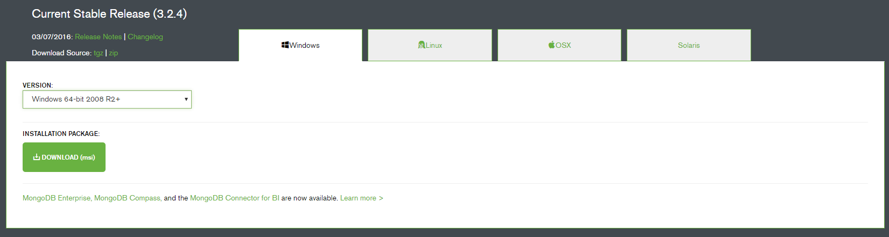

# 安装 MongoDB

## Windows 安装 MonngoDB

### 下载 MongoDB

进入[MongoDB下载页](https://www.mongodb.org/downloads#production)下载使用于Windows版本的安装包 :



然后运行安装程序进行安装。

**创建数据目录**

MongoDB将数据目录存储在db目录下，但是这个目录不会主动创建，我们需要手动在根目录下(如 `c:\`, `d:\`等)创建它。

以下是我在 `I`盘创建的例子 :

```shell
c:\>I:

I:\>mkdir data

I:\>cd data

I:\data>mkdir db

I:\data>cd db

I:\data\db>
```

也可以通过资源管理器创建文件夹的形式创建这些目录。

### 启动 MongoDB 服务器

在 MongoDB 的安装目录下的 `bin`文件夹下执行启动命令 `mongod.exe --dbpath I:\data\db`:

```shell
xiaochai@CHAI C:\Program Files\MongoDB\Server\3.2\bin
> mongod.exe --dbpath I:\data\db
2016-04-12T14:42:45.335+0800 I CONTROL  [initandlisten] MongoDB starting : pid=760 port=27017 dbpath=I:\data\db 64-bit host=chai
2016-04-12T14:42:45.336+0800 I CONTROL  [initandlisten] targetMinOS: Windows Vista/Windows Server 2008
2016-04-12T14:42:45.336+0800 I CONTROL  [initandlisten] db version v3.2.4
2016-04-12T14:42:45.336+0800 I CONTROL  [initandlisten] git version: e2ee9ffcf9f5a94fad76802e28cc978718bb7a30
2016-04-12T14:42:45.336+0800 I CONTROL  [initandlisten] allocator: tcmalloc
2016-04-12T14:42:45.336+0800 I CONTROL  [initandlisten] modules: none
2016-04-12T14:42:45.336+0800 I CONTROL  [initandlisten] build environment:
2016-04-12T14:42:45.336+0800 I CONTROL  [initandlisten]     distarch: x86_64
2016-04-12T14:42:45.336+0800 I CONTROL  [initandlisten]     target_arch: x86_64
2016-04-12T14:42:45.336+0800 I CONTROL  [initandlisten] options: { storage: { dbPath: "I:\data\db" } }
2016-04-12T14:42:45.337+0800 I STORAGE  [initandlisten] wiredtiger_open config: create,cache_size=8G,session_max=20000,eviction=(threads_max=4),config_base=false,statistics=(fast),log=(enabled=true,archive=true,path=journal,compressor=snappy),file_manager=(close_idle_time=100000),checkpoint=(wait=60,log_size=2GB),statistics_log=(wait=0),
2016-04-12T14:42:46.216+0800 I NETWORK  [HostnameCanonicalizationWorker] Starting hostname canonicalization worker
2016-04-12T14:42:46.216+0800 I FTDC     [initandlisten] Initializing full-time diagnostic data capture with directory 'I:/data/db/diagnostic.data'
2016-04-12T14:42:46.438+0800 I NETWORK  [initandlisten] waiting for connections on port 27017
```

看到以上输出即表示MongoDB服务器启动成功。

### MongoDB 后台管理 Shell

如果你需要进入 MongoDB 的后台管理，同样需要进入MongoDB的安装目录下的`bin`目录，然后执行`mongo.exe`文件，MongoDB Shell是MongoDB自带的交互式Javascript shell,用来对MongoDB进行操作和管理的交互式环境。

当你进入mongoDB后台后，它默认会链接到 test 文档（数据库）:

```shell
xiaochai@CHAI C:\Program Files\MongoDB\Server\3.2\bin
> mongo.exe
MongoDB shell version: 3.2.4
connecting to: test
```

由于它是一个JavaScript shell，您可以运行一些简单的算术运算 :

```shell
> 2+2
4
>
```

**db** 命令用于查看当前操作的文档（数据库）:

```shell
> db
test
>   
```

插入一些简单的记录并查找它 :

```shell
> db.test.insert({n:1024})
WriteResult({ "nInserted" : 1 })
> db.test.find()
{ "_id" : ObjectId("570da61cdd1ba4f846e9824e"), "n" : 1024 }
>
```

### 安装 MongoDB 服务

> 以管理员权限运行以下命令。

可以选择命令行的形式重新安装MongoDB服务器:

```shell
msiexec.exe /q /i mongodb-win32-x86_64-3.2.4-signed.msi INSTALLLOCATION="C:\mongodb" ADDLOCAL="all"
```

指定数据存储目录 :

```shell
C:\mongodb\bin>mongod.exe --dbpath I:\data\db
```

创建日志目录 :

```shell
mkdir c:\data\db
mkdir c:\data\log
```

安装 MongoDB 服务 :

```shell
"C:\mongodb\bin\mongod.exe" --config "C:\mongodb\mongod.cfg" --install
```

启动 MongoDB 服务 :

```shell
C:\mongodb\bin>net start MongoDB

MongoDB 服务已经启动成功。
```

移除 MongoDB 服务 :

```shell
net stop MongoDB
"C:\mongodb\bin\mongod.exe" --remove
```

## Linux 安装 MongoDB
