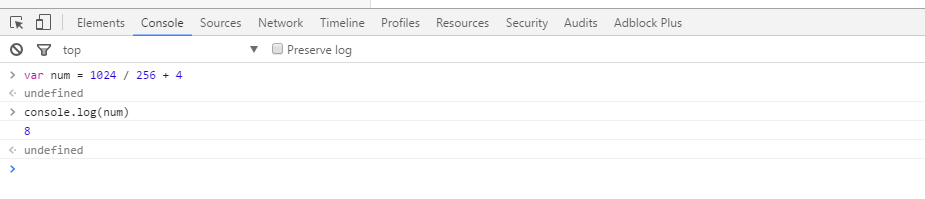

## 2.1 快速入门

---

### 引入 JavaScript 的两种方式

+ JavaScript代码可以直接嵌在网页的任何地方，通常都把JavaScript代码放到`<head>`标签中：

```javascript
<html>
<head>
  <script>
    alert('Hello, world');
  </script>
</head>
<body>
  ...
</body>
</html>
```

由`<script>...</script>`包含的代码就是JavaScript代码，它将直接被浏览器执行。

+ 第二种方法是把JavaScript代码放到一个单独的`.js`文件，然后在HTML中通过`<script src="..."></script>`引入这个文件：

```
<html>
<head>
  <script src="/static/js/abc.js"></script>
</head>
<body>
  ...
</body>
</html>
```

这样，`/static/js/abc.js`就会被浏览器执行。

把JavaScript代码放入一个单独的`.js文`件中更利于维护代码，并且多个页面可以各自引用同一份`.js`文件。

可以在同一个页面中引入多个`.js`文件，还可以在页面中多次编写`<script> js代码... </script>`，浏览器按照顺序依次执行。

有些时候你会看到`<script>`标签还设置了一个type属性：

```
<script type="text/javascript">
  ...
</script>
```

但这是没有必要的，因为默认的type就是JavaScript，所以不必显式地把type指定为JavaScript。

### 调试

在 Chrome 浏览器的开发者模式下，可以在console窗口下运行JavaScript代码:

```javascript
var num = 1024 / 256 + 4
console.log(num)
```


### 基本语法

* JavaScript 语法与Java类似，每句以`;`结束，代码块用`{...}`
* JavaScript 语句结尾的`;`可以省略，浏览器负责执行JavaScript代码的引擎会补上`;`
* 但是不推荐省略`;`，因为引擎自动加`;`可能会导致语义改变

** 赋值语句 **
```
var x = 1;  //这是一个完整的赋值语句

'Hello world';  //这也是一个完整的语句

var x = 1; var y = 2;   // 一行可以包含多个语句，每个语句以 `;`分割，但是不建议这么写
 
```

** 语句块 **

* 语句块通常使用`{...}`
* `{...}` 内的语句通常要缩进(4个空格)为了方便我们查看代码层次，不是JavaScript语法必须的
* `{...}` 可以多层级嵌套，JavaScript本身对嵌套的层级没有限制，但是过多的嵌套无疑会大大增加看懂代码的难度。遇到这种情况，需要把部分代码抽出来，作为函数来调用，这样可以减少代码的复杂度。

### 注释

注释是给开发人员看到，JavaScript引擎会自动忽略

* 行注释: `// 我是注释`
* 块注释: `/* 我是注释 */`

---End---

---
[返回目录](/javascript/index.md)
