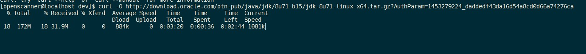
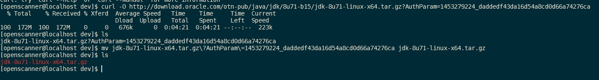
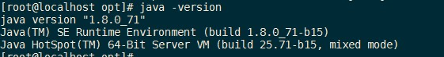
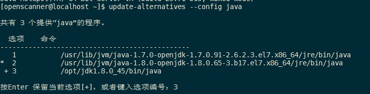

### CentOS7 配置 JDK8

**1. curl 下载**

CentOS 自带`curl`，因此可以去JDK官网获取linux版本的下载链接，然后通过curl命令下载 JDK. 以JDK8为例 :

```
$ curl -O http://download.oracle.com/otn-pub/java/jdk/8u71-b15/jdk-8u71-linux-x64.tar.gz?AuthParam=1453279224_daddedf43da16d54a8cd0d66a74276ca
```

今天发现不灵光了，那就换 `wget` 吧

```
wget --no-cookies --no-check-certificate --header "Cookie: gpw_e24=http%3A%2F%2Fwww.oracle.com%2F; oraclelicense=accept-securebackup-cookie" "http://download.oracle.com/otn-pub/java/jdk/8u72-b15/jdk-8u72-linux-x64.tar.gz"
```



**2. 重命名**

下载完成后进行重命名操作 :

```
$ mv jdk-8u71-linux-x64.tar.gz\?AuthParam\=1453279224_daddedf43da16d54a8cd0d66a74276ca jdk-8u71-linux-x64.tar.gz
```



**3. 解压**

```
$ tar -xzvf jdk-8u71-linux-x64.tar.gz
```

**4. 移动**

将jdk解压后的文件移动到你要安装的路径 :

```
$ mv jdk1.8.0_71 /opt/
```

**5. 配置JDK环境变量**

配置JDK环境变量，在`/etc/profile`的末尾追加一下内容 :

```
####### Java ##########
export JAVA_HOME=/opt/jdk1.8.0_71
export JRE_HOME=$JAVA_HOME/jre                 #tomcat需要
export CLASSPATH=.:$JAVA_HOME/lib:$JRE_HOME/lib
export PATH=$JAVA_HOME/bin:$JRE_HOME/bin:$PATH
```

更新完成profile之后，我们再执一行下面的语句（读取并执行）：

```
$ source  /etc/profile
```

然后查看Java 版本信息 :

```
$ java -version
```



**6. 配置Java首选项**

```
$ update-alternatives --config java
```


