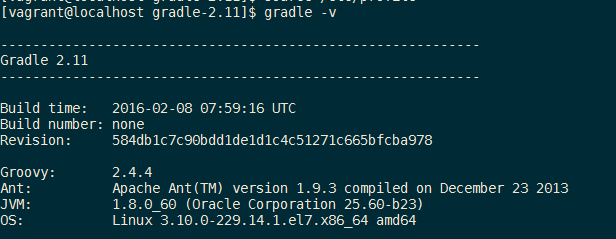

# 安装Gradle

> 确保你已经安装了JDK1.5或以上版本。

## 1. 下载

访问 [Gradle官网](http://gradle.org/) 下载或者通过`curl`命令下载，命令如下 ：

```
curl -O https://downloads.gradle.org/distributions/gradle-2.11-all.zip
```

## 2. 解压到 `/opt` 目录下

```
sudo unzip gradle-2.11-all.zip
```

## 3. 配置环境变量

配置 `GRADLE_HOME` 到 `/etc/profile`, 在文件末尾追加以下配置 :

```
#### GRADLE ####
export GRADLE_HOME=/opt/gradle-2.11
export PATH=$JAVA_HOME/bin:$JRE_HOME/bin:$GRADLE_HOME/bin:$PATH
```

更新完成profile之后，我们再执一行下面的语句（读取并执行）：

```
$ source  /etc/profile
```

## 4. 查看`gradle`版本

配置完环境变量以后，通过shell命令查看`gradle`版本，以确保安装完成 :

```
gradle -v
```

可以看到以下结果就说嘛安装完成了 :


