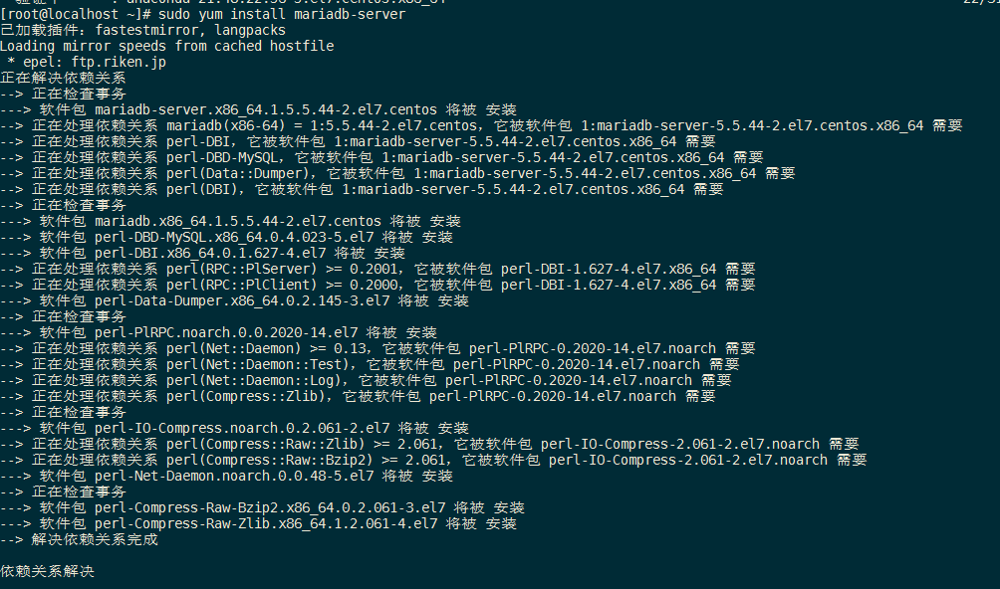
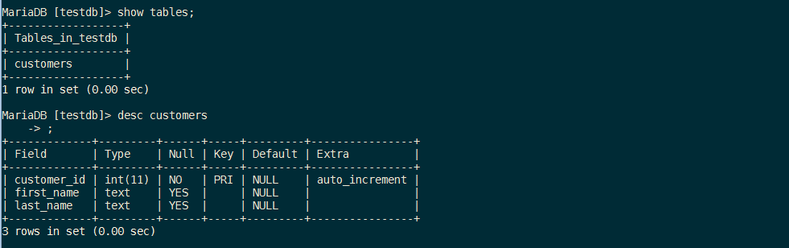
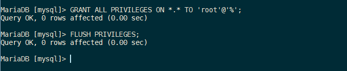

# 安装MariaDB

> 本笔记记录的是`root`用户权限安装MariaDB的过程，非`root`权限用户需要使用`sudo`前缀提升权限。

*MariaDB 是流行的跨平台的数据库管理系统MySQL的一个分支，被认为是一个可以替换MySQL的完整简易的产品。*

## 开始之前

#### 1. 确保你遵循了服务器的入门和保护想到，Linode的主机名设置

```
hostname       #显示你主机名
hostname -f    #显示完全限定域名(FQDN)
```

#### 2. Update your system:

```
sudo yum update
```

## 安装和启动MariaDB

```
sudo yum install mariadb-server
```



此处选择 `y` :


安装完成 :


将MariaDB设置为开机启动，然后启动服务:


```
sudo systemctl enable mariadb
sudo systemctl start mariadb
```

如图 :


## 强化MySQL Server

#### 1. 运行 `ysql_secure_installation`脚本，以解决在默认的MySQL安装一些安全问题。

```
sudo mysql_secure_installation
```


> 您将有选择更改MySQL的root密码，删除匿名用户帐户，禁止本地主机之外的root用户登录，并删除测试数据库。建议你回答 `Yes `这些选项。你可以在MySQL参考手册中读到更多关于脚本。

全部选择 `y` :


完成配置 :


## 使用MySQL

对于与MySQL进行交互的标准工具是MySQL客户端，已经在mysql-server中安装了。MySQL的客户端是通过命令终端使用的。

## Root 登录

#### 1. 通过root用户登录MySQL

```
mysql -u root -p
```

#### 2. 按照提示，输入你之前在执行`mysql_secure_installation`脚本运行时设置的root密码。
验证通过之后你会看到MiaraDB提示，如图：


#### 3 输入`\h`，就会生成MySQL的命令提示列表。如图 :


## 创建一个新的MySQL用户和数据库

#### 1. 在下面的例子中，`testdb`是数据库名字，`testuser`是用户名，`password`是用户密码

```
create database testdb;
create user 'testuser'@'localhost' identified by 'password';
grant all on testdb.* to 'testuser' identified by 'password';
```


你可以缩短 这个过程，在配置数据库权限的同时创建用户：

```
create database testdb;
grant all on testdb.* to 'testuser' identified by 'password';
```

#### 2. 退出MariaDB

```
exit
```


## 创建一个简单的表 :

#### 1. 以 `testuser` 用户登录：

```
mysql -u testuser -p
```


#### 2. 创建一个名为`customers`的简单表，创建客户的`ID` 类型为`INT `型整数，是自动增长的用于主键，以及用于存储客户姓和名的两个字段。

```
use testdb;
create table customers (customer_id INT NOT NULL AUTO_INCREMENT PRIMARY KEY, first_name TEXT, last_name TEXT);
```


查看所有表，查看表结构，确认表已建立 :

```
show tables;
desc customers;

```




#### 3. 退出MySQL
```
exit
```


## 重置 MySQL root 密码

> 如果你忘记了MySQL的root密码，可将其重置。

#### 1. 停止当前的MySQL服务器，然后启用一个参数不需要输入密码重启它。

```
sudo systemctl stop mariadb
sudo mysqld_safe --skip-grant-tables &
```

#### 2. 重新使用MySQL root账户 登录MySQL服务器


#### 3. 使用以下命令重置root的密码。使用强密码替换之前的密码 : `password`。

```
use mysql;
update user SET PASSWORD=PASSWORD("password") WHERE USER='root';
flush privileges;
```


```
MariaDB [mysql]> update user SET PASSWORD=PASSWORD("rootpwd") WHERE USER='root';
```


`flush privileges;`


#### 4. 重启 MySQL


使用新密码登录root账号，此时密码为`rootpwd` :


## Tune NySQL

> Tune NySQL 是一个Perl脚本，可以连接到MySQL的运行实例，提供了基于工作负载的配置建议。理想情况下，MySQL实例在运行tuner之前，至少应该已经运作了24小时以上。该实例已经运行了很长的时间，Tuner会给MySQL提供更多的调整建议。

#### 1. 下载MySQL Tuner 到你的主目录下：

```
wget https://raw.githubusercontent.com/major/MySQLTuner-perl/master/mysqltuner.pl
```


#### 2. 运行

```
perl ./mysqltuner.pl
```

你会被要求提供NySQL的root用户名和密码


将会显示两个有用的输出：一般建议和变量进行调整。


MySQL的调节器基于一个很好的出发点，以优化MySQL服务器，但要谨慎的配置量身定做的程序，在你的linode利用MySQL中执行额外的研究。


## 卸载

#### 1. 查看安装版本

```
yum list installed mariadb*
```


或者

```
 rpm -qa | grep mariadb
```


```
yum remove mysql-server mysql-libs mysql-devel mysql*
```


## 附 :

远程连接:

首先查看root用户设置的链接地址：


由图可见，都是本地的账户。所以，配置下 MariaDB 允许 root 账号在任意账号登录:

```
GRANT ALL PRIVILEGES ON *.* TO 'root'@'%';
FLUSH PRIVILEGES;
```




## 更多信息

你不妨参考以下资源有关此主题的其他信息，不一定是最新版，是当前最新版。

[tt](tt)
!(MySQL 5.7 Reference Manual)[http://dev.mysql.com/doc/refman/5.7/en/]

!(MySQL Tuner Tutorial)[http://www.debiantutorials.com/tuning-mysql-with-mysqltuner-to-increase-efficiency-and-performance/]


---enf
